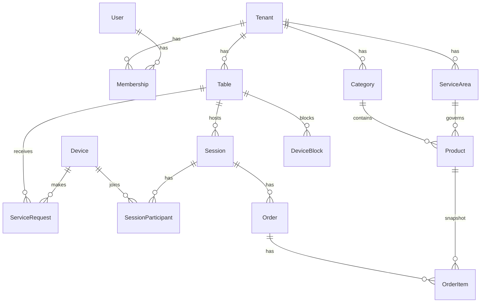

# Modelo de Domínio

## Decisões de modelagem
| Sugestão original | Adotado | Motivo |
|---|---|---|
| Tenant / Restaurant | `Tenant` (único) | 1 tenant = 1 estabelecimento no MVP. `Location` futuro (PDR-009). |
| TableQRCode | `Table.public_token` + `RevokedTableToken` | O QR *é* um token. Entidade separada só para histórico de rotação. |
| SessionParticipant/Device | `Device` **e** `SessionParticipant` | Anti-spam precisa do dispositivo *antes* de existir sessão. |
| Request | `ServiceRequest` | Evita colisão com HTTP request; cobre `open_session` e `resume_session`. |
| Kitchen/ServiceStatus | `ServiceArea` (`kitchen`, `bar`) | Mesmo custo de um booleano, e "bar fecha às 3h" vira dado. |
| Role (tabela) | enum em `Membership` | Permissões customizadas são FUTURE. |

**Estado da mesa é derivado**, não persistido — evita duas fontes de verdade sob concorrência.

## Entidades

```
Tenant
  id, slug, name, logo_url?, primary_color, status(active|blocked), settings jsonb, created_at

User                           -- funcionários e platform admins. Cliente NÃO é User.
  id, email UNIQUE, password_hash, name, is_platform_admin, created_at

Membership
  id, tenant_id, user_id, role(admin|operator|waiter), status(invited|active|disabled),
  invited_at, accepted_at
  UNIQUE(tenant_id, user_id)

StaffDevice                    -- sessão longa do garçom/operador (PDR-011)
  id, user_id, tenant_id, refresh_token_hash, label, last_seen_at, revoked_at

Table
  id, tenant_id, display_name, public_token UNIQUE (global), is_active, sort_order, created_at
  -- state é derivado (ver state-machines.md)

RevokedTableToken (SHOULD)
  token, table_id, revoked_at

ServiceArea
  id, tenant_id, key(kitchen|bar), name, is_open, changed_at, changed_by_user_id?
  UNIQUE(tenant_id, key)

Category
  id, tenant_id, name, sort_order, is_active

Product
  id, tenant_id, category_id, service_area_id, name, description?, price_cents, image_url?,
  is_available, sort_order, created_at, updated_at, deleted_at?   -- soft delete

Device                         -- pseudônimo anônimo do navegador do cliente
  id, tenant_id, first_seen_at, last_seen_at

ServiceRequest
  id, tenant_id, table_id, device_id, type(open_session|resume_session),
  status(pending|approved|rejected|expired|cancelled),
  session_id?, pending_order_id?,
  created_at, expires_at, resolved_at?, resolved_by_user_id?, resolution(new_session|continue_session)?
  PARTIAL UNIQUE (table_id, device_id) WHERE status = 'pending'

DeviceBlock
  id, tenant_id, table_id, device_id, blocked_until, reason, created_at

Session
  id, tenant_id, table_id, status(active|inactive|closed),
  pin_encrypted, pin_failed_attempts, pin_locked_until?,
  opened_at, opened_by(operator|waiter), opened_by_user_id?,
  last_activity_at, closed_at?, closed_by_user_id?, close_reason?
  PARTIAL UNIQUE (table_id) WHERE status IN ('active','inactive')

SessionParticipant
  id, session_id, device_id, ordinal (Cliente 1, 2, 3…), joined_at, joined_via(approval|pin|migrated)
  UNIQUE(session_id, device_id)

Order
  id, tenant_id, session_id, sequence_no (por sessão), status,
  created_by_kind(customer|staff), participant_id?, user_id?,
  total_cents, created_at, acknowledged_at?, acknowledged_by_user_id?,
  cancelled_at?, cancelled_by_user_id?, cancel_reason?
  UNIQUE(session_id, sequence_no)

OrderItem
  id, order_id, product_id, product_name_snapshot, unit_price_cents_snapshot, quantity, notes?

DomainEvent (outbox)
  id, tenant_id, aggregate_type, aggregate_id, type, actor jsonb, payload jsonb, created_at, published_at?

IdempotencyKey
  key, tenant_id, scope, response_hash, created_at
```

## Agregados e invariantes
- **Table** é a raiz de concorrência: toda mudança de sessão/solicitação faz `SELECT … FOR UPDATE` na mesa.
- **Session** possui Participants e Orders. Sessão `closed` é imutável.
- **Order** é imutável após criação, exceto transições de status.
- **Product** nunca é apagado fisicamente enquanto referenciado por `OrderItem`.
- Ator polimórfico em `Order` (`created_by_kind` + `participant_id | user_id`) cumpre o princípio 7: um único motor de pedidos.

## Diagrama

