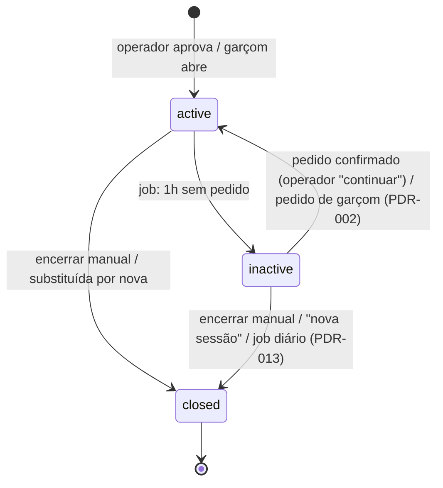
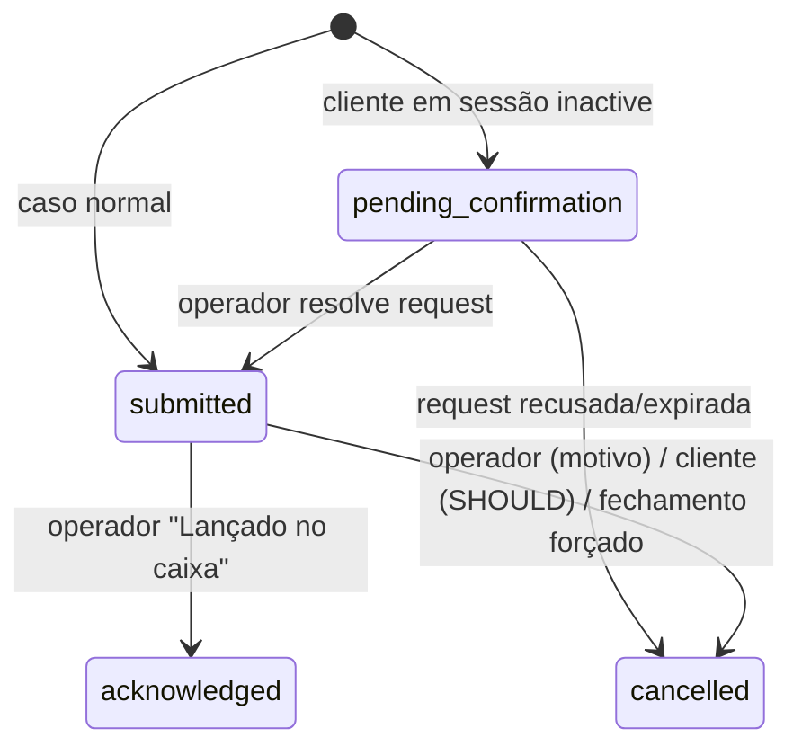

# Máquinas de Estado

## Mesa (derivado)
```
FREE       ← is_active ∧ sem sessão viva ∧ sem request pendente
REQUESTED  ← is_active ∧ sem sessão viva ∧ request open_session pendente
OCCUPIED   ← sessão.status = active
INACTIVE   ← sessão.status = inactive (pode ter request resume/open pendente)
DISABLED   ← is_active = false
```
"Encerrada" é evento, não estado: sessão fecha ⇒ mesa volta a FREE imediatamente.

## Sessão

- `closed` é terminal. PIN inválido, participantes perdem acesso, comanda preservada.
- `close_reason ∈ {manual, replaced_by_new, forced_with_pending, daily_auto}`.

## ServiceRequest

```mermaid
stateDiagram-v2
  [*] --> pending
  pending --> approved : operador aprova (resolution: new_session | continue_session)
  pending --> rejected : operador recusa (conta para bloqueio)
  pending --> expired : 10 min sem resposta / mesa mudou de estado (não conta)
  pending --> cancelled : cliente desiste (SHOULD; não conta)
```


## Pedido

Sem `preparing`/`delivered`: é KDS, fora de escopo. `acknowledged` é o handoff para o sistema do restaurante.

## Produto (derivado para exibição)
```
ORDERABLE    ← is_available ∧ service_area.is_open ∧ deleted_at IS NULL
UNAVAILABLE  ← ¬is_available                 → rótulo "Indisponível"
AREA_CLOSED  ← ¬service_area.is_open         → rótulo "Cozinha encerrada" / "Bar encerrado"
REMOVED      ← deleted_at IS NOT NULL        → some do cardápio, permanece em pedidos antigos
```

## ServiceArea
`open ⇄ closed` — toggle por admin/operador, auditado via DomainEvent.

## Device (anti-spam)
```
normal → blocked (2 rejeições em 15 min para a mesma mesa) → normal (após blocked_until)
```
